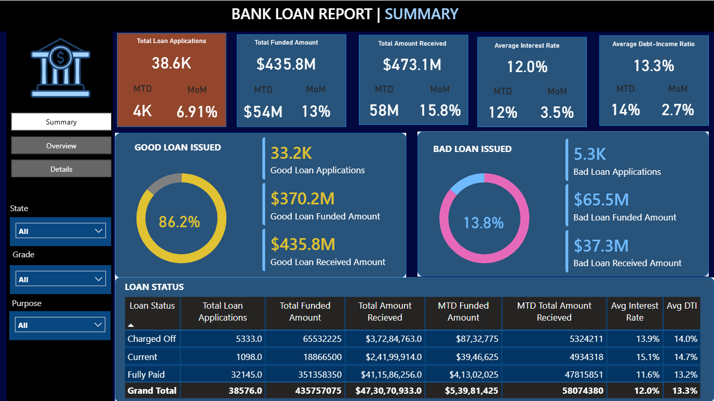
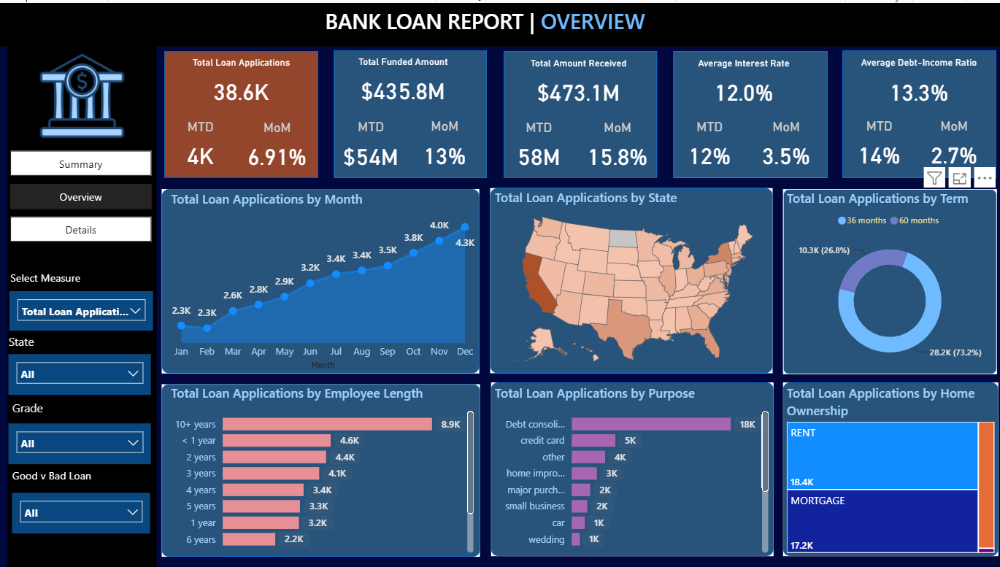
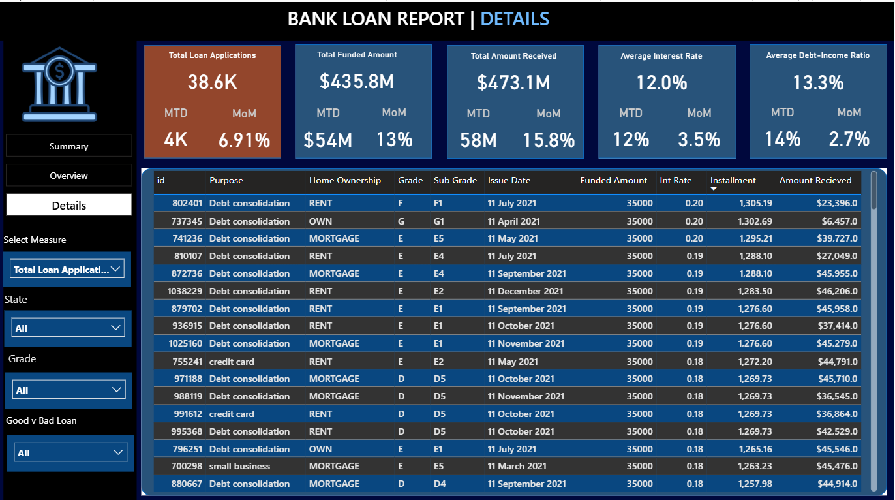

# 📊 Bank Loan Analysis Dashboard


## 📌 Project Overview

This project presents an end-to-end **Bank Loan Analysis** solution developed using **Python, SQL Server, and Power BI**. The objective is to analyze loan application data, calculate key business KPIs, and build an interactive dashboard that enables stakeholders to monitor loan performance, customer behavior, and lending trends.

The project follows a complete analytics workflow, including:

- Data exploration and cleaning using Python
- KPI calculation and business analysis using SQL
- Interactive dashboard development using Power BI

---

## 🎯 Business Objectives

- Analyze overall loan application trends.
- Monitor funded and received loan amounts.
- Evaluate good and bad loan performance.
- Understand customer demographics and loan purposes.
- Track monthly lending performance.
- Provide an interactive dashboard for business decision-making.

---

# 🛠️ Tech Stack

| Tool | Purpose |
|------|---------|
| Python | Data Cleaning & Exploratory Data Analysis |
| Pandas | Data Manipulation |
| NumPy | Numerical Computing |
| Matplotlib | Data Visualization |
| Seaborn | Statistical Visualization |
| SQL Server | Business Queries & KPI Calculation |
| Power BI | Interactive Dashboard |
| Excel | Source Dataset |

---

# 📂 Dataset

The dataset contains **38,576 loan applications** with **24 attributes**, including:

- Loan Amount
- Interest Rate
- Loan Status
- Purpose
- Grade & Sub Grade
- Home Ownership
- Employment Length
- Annual Income
- Debt-to-Income Ratio (DTI)
- State
- Issue Date

---

# 📈 Key Performance Indicators (KPIs)

The dashboard provides the following business metrics:

- ✅ Total Loan Applications
- ✅ Month-to-Date (MTD) Loan Applications
- ✅ Total Funded Amount
- ✅ MTD Funded Amount
- ✅ Total Amount Received
- ✅ MTD Amount Received
- ✅ Average Interest Rate
- ✅ Average Debt-to-Income Ratio (DTI)
- ✅ Good Loan Percentage
- ✅ Bad Loan Percentage

---

# 📊 Dashboard Pages

## 1️⃣ Summary Dashboard

The Summary Dashboard provides an overview of the bank's lending performance through KPI cards and loan quality metrics.

Features include:

- Total Loan Applications
- Total Funded Amount
- Total Amount Received
- Average Interest Rate
- Average DTI
- Good Loan KPIs
- Bad Loan KPIs
- Loan Status Summary



---

## 2️⃣ Overview Dashboard

The Overview Dashboard helps analyze loan trends across different business dimensions.

Visualizations include:

- Monthly Loan Trends
- State-wise Loan Applications
- Loan Purpose Analysis
- Home Ownership Analysis
- Employment Length Analysis
- Loan Term Distribution



---

## 3️⃣ Details Dashboard

The Details Dashboard provides transaction-level loan information with interactive filtering capabilities.

It enables users to explore individual loan records based on various criteria.



---

# 🐍 Python Analysis

The Jupyter Notebook includes:

- Data Import
- Data Inspection
- Data Cleaning
- Data Type Validation
- Statistical Summary
- Exploratory Data Analysis
- KPI Calculation

Notebook Location:

```
notebooks/Bank Loan Project.ipynb
```

---

# 🗄️ SQL Analysis

SQL Server was used to calculate business KPIs and generate insights such as:

- Total Loan Applications
- Monthly Loan Applications
- Good Loan Analysis
- Bad Loan Analysis
- State-wise Analysis
- Loan Purpose Analysis
- Home Ownership Analysis
- Employee Length Analysis

SQL scripts are available in the **sql/** directory.

---

# 📁 Project Structure

```
Bank-Loan-Analysis/
│
├── data/
│   └── financial_loan_data_excel.xlsx
│   └── financial_Loan.csv
├── images/
│   ├── Summary.png
│   ├── Overview.png
│   └── Details.png
│
├── notebooks/
│   └── Bank Loan Project.ipynb
│
├── powerbi/
│   └── Bank Loan Dashboard.pbix
│
├── sql/
│   ├── KPI_Queries.sql
│   └── Dashboard_Queries.sql
│
├── README.md
├── requirements.txt
└── .gitignore
```

---

# 🚀 How to Run the Project

### Clone the repository

```bash
git clone https://github.com/YOUR_USERNAME/Bank-Loan-Analysis.git
```

### Install required libraries

```bash
pip install -r requirements.txt
```

### Open the Jupyter Notebook

```
notebooks/Bank Loan Project.ipynb
```

### Open the Power BI Dashboard

```
powerbi/Bank Loan Dashboard.pbix
```

---

# # 💡 Key Insights

- The dataset contains **38,576 loan applications**, with a **total funded amount of $435.8M** and **total payments received of $473.1M**.

- **Good loans account for 86.2%** of all applications, while **bad loans represent 13.8%**, indicating a healthy overall loan portfolio.

- The bank achieved a **loan repayment rate exceeding the total funded amount**, suggesting strong repayment performance across most customers.

- Loan applications show a steady increase throughout the year, with the highest application volume recorded during the later months.

- Borrowers with **mortgage and rent** home ownership represent the largest share of loan applicants.

- **Debt Consolidation** is the most common purpose for loan applications, followed by credit card and home improvement loans.

- Most approved loans fall within the **36-month loan term**, indicating customer preference for shorter repayment periods.

- Borrowers with **longer employment history** generally account for a larger proportion of approved loans, suggesting employment stability plays an important role in lending.

- Geographic analysis highlights significant variation in loan applications across different states, helping identify regions with higher lending activity.

- Interactive filters allow users to analyze lending performance by **state, loan purpose, employment length, home ownership, and loan status**, enabling detailed business analysis.

---

# 🔮 Future Improvements

- Develop a machine learning model to predict loan default.
- Connect Power BI directly to SQL Server.
- Automate dashboard refresh.
- Publish the dashboard to Power BI Service.

---

# 👨‍💻 Author

**Mudasir Bhat**

- GitHub: https://github.com/mudasirr13
- LinkedIn: *([https://www.linkedin.com/in/mudasir-bhat-196213219/])*

---

⭐ If you found this project useful, consider giving it a star.
